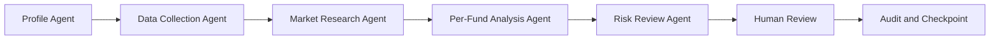

# Agent 架构

## 工作流

LangGraph 负责节点编排、中断恢复和 SQLite checkpoint。checkpoint 保存工作流共享状态与节点进度，不包含模型参数，也不是训练 checkpoint。

## 公开核心

- `data.py`：确定性合成价格，或调用显式安装的价格插件。
- `fund_analysis.py`：技术指标、Skill 聚合和中性研究标签。
- `backtest.py`：使用固定换手成本的 walk-forward 组合回测。
- `paper_trading.py`：前向信号方向验证，不模拟真实订单。
- `agent_workflow.py`：日、周、月工作流、人工确认和审计状态。
- `scheduler.py`：基于 SQLite 的任务抢占、租约恢复和多次尝试审计。
- `streamlit_app.py`：本地任务、CSV、验证和历史界面。
- `adapters.py`：私有增强或第三方插件的类型化边界。

## 共享状态

`AgentState` 在节点之间传递任务 ID、配置路径、合成价格文件、报告路径、研究信号、风险检查和审计 trace。写入路径必须位于已允许的 `user_data/` 根目录，任务 ID 不能包含路径分隔符。

调度器的 `scheduler_runs.sqlite3` 与 LangGraph checkpoint 相互独立。调度数据库以任务类型和计划日期为唯一键，通过租约避免并发重复运行，并保留失败或放弃尝试；checkpoint 用于恢复单次 Agent 工作流。只有完成、待确认、已批准、已拒绝和风险阻断等调度终态才会阻止同日任务重跑。

## 信号语义

| 标签 | 代码 | 含义 |
| --- | --- | --- |
| 偏强 | `strong` | 当前离线指标呈正向特征，需人工核验 |
| 观察 | 不进入审批项 | 置信度或绝对分数未达到阈值 |
| 偏弱 | `weak` | 当前离线指标呈负向特征，需人工核验 |
| 风险退出 | `risk_exit` | 高置信负向风险标签，不是赎回指令 |

目标权重、标签和前向验证彼此分离，避免用组合优化结果直接生成交易动作。

## 插件信任边界

公开包没有网络适配器。宿主安装插件后，插件代码与数据源不再处于本项目的默认安全和授权保证范围内。插件输出会经过基本结构校验，但使用者仍需审查授权、隐私、网络、提示注入和数据质量。

已安装为依赖时，核心默认使用宿主当前工作目录作为项目根；宿主也可显式设置 `FUND_AGENT_PROJECT_ROOT` 和 `FUND_AGENT_USER_DATA_ROOT`。私有增强包应在加载用户配置前设置这两个路径，并通过 `install_adapters()` 注册能力。
